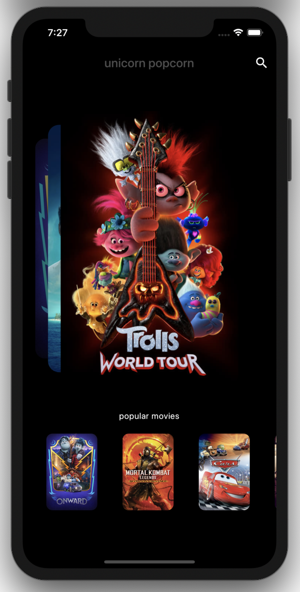
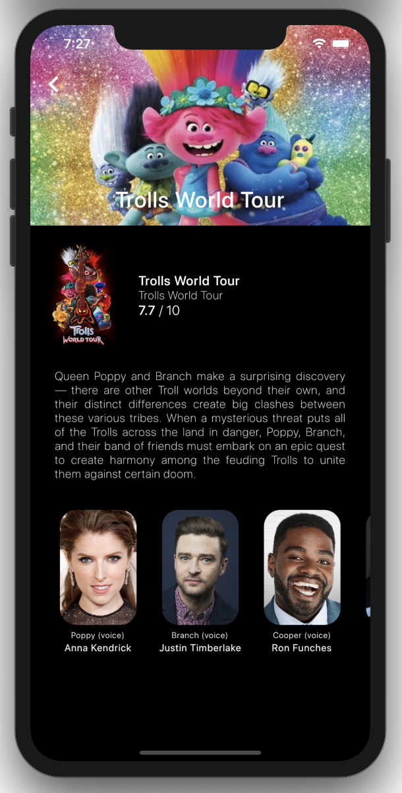
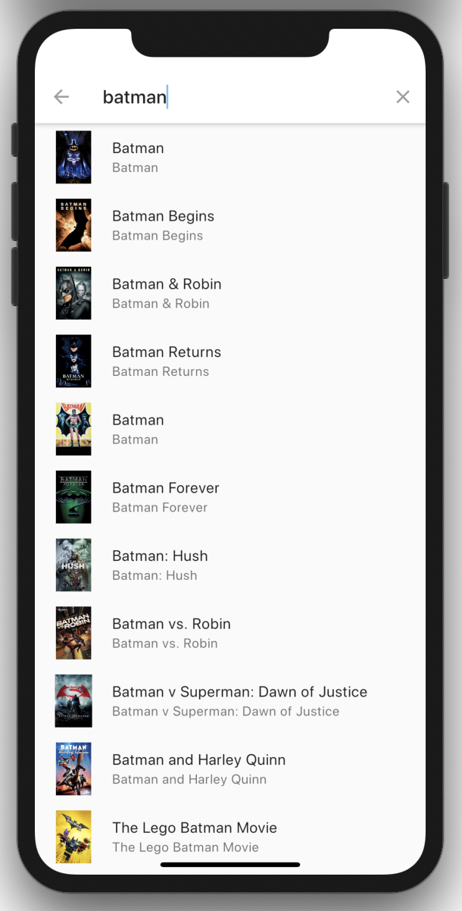

#### 🦄✨unicorn popcorn ✨🦄

#### About unicorn_popcorn app:
Search App for movies in theaters and populars.

#### About the tech stack:
Made with love & Dart (Flutter).

#### About the features:
- REST service consumption
- JSON Conversion > Maps > Models
- PageViews
- ApiKeys
- Providers 
- Streams
- Infinite Horizontal Scroll
- SearchDelegate

#### Some examples: 

